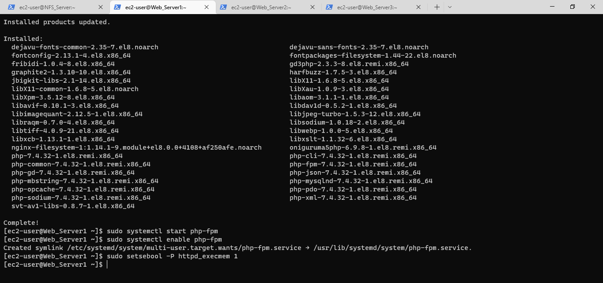
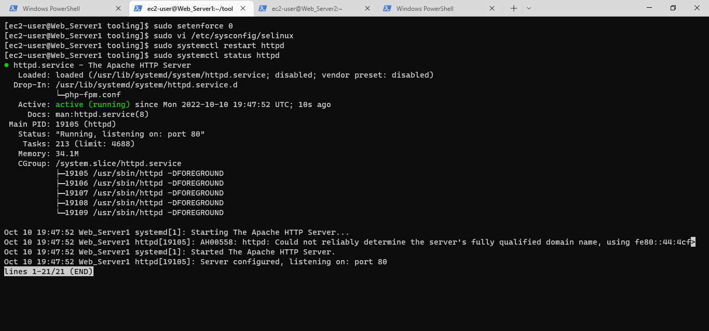

# PROJECT 7 - DevOps-Tooling-Website-Solution
___
____
### **Step 1 - Setting up Instances for all the Servers**
___
>#### Launch 1 EC2 instance with RHEL Linux 8 Operating System for the NFS Server. 

>#### Creating & Attaching -3- 8GiB Volumes to the NFS Servers in the same AZ.

### **Step 2 - Preparing the NFS Server**
___
>#### Checking Block Devices, Mount Volumes & Available Spaces.
#### Using *`lsblk`* & *`df-h`* command to inspect what block devices are attached to my NFS server and the spaces available. 

>#### Partitioning the Attached Volumes
#### Using *`gdisk`* utility to create a single partition on each of the 3 disks the command *`sudo gdisk /dev/xvdb/xvdc/xvdd`* is applied on each of the disk.

 to be used by LVM
* *`sudo pvs`* - Verify that the PV has been created successfully by running
* Using **vgcreate** to create the Volume Group- *`sudo vgcreate webdata-vg /dev/xvdb1`*, *`sudo vgcreate webdata-vg /dev/xvdc1`* & *`sudo vgcreate webdata-vg/dev/xvdd1`* - adds all 3 PVs to a volume group (VG).
* *`sudo vgs`* - Verifies that the VG has been created successfully by running
* Using **lvcreate**  utility to create 3 logical volumes. **opt-lv**, **apps-lv**  and **logs-lv** Share into 3 across the PV. NOTE: apps-lv will be used to store data for the Web Server, logs-lv will be used to store logs by webserver while opt-lv will be used by Jenkins - *`sudo lvcreate -n lv-opt -L 7.9G nfsdata-vg`*, *`sudo lvcreate -n lv-apps -L 8G nfsdata-vg`* & *`sudo lvcreate -n lv-logs -L 8G nfsdata-vg`*
* *`sudo lvs`* - Verifies that the LV has been created successfully by running 
* *`sudo vgdisplay -v`* or *`sudo lsblk`* - views complete setup - VG, PV, and LV

* Formating the LV with mkfs.xfs with xfs filesystems *`sudo mkfs.xfs /dev/nfsdata-vg/lv-opt`* & *`sudo mkfs.xfs /dev/nfsdata-vg/lv-apps`* & *`sudo mkfs.xfs /dev/nfsdata-vg/lv-logs`* commands are used.

>####  Creating Directories and Mounting Volumes in the Web Server.
* *`sudo mkdir /mnt/opt /mnt/apps /mnt/logs`* -  **/mnt/opt** Creates directory for Jenkins data,  **/mnt/apps**- creates directory that stores data for webserver & **/mnt/log**- creates directory that stores log for websever.
* *`sudo mount /dev/nfsdata-vg/lv-opt /mnt/opt`* - Mount **/mnt/opt** on opt-lv logical volume, 
* *`sudo mount /dev/nfsdata-vg/lv-apps /mnt/apps`* - Mount **/mnt/apps** on aps-lv logical volume & 
* *`sudo mount /dev/nfsdata-vg/lv-logs /mnt/logs`* - Mount **/mnt/logs** on logs-lv logical volume.

>####  Installing  NFS server
* *`sudo yum -y update`* - updates all the presently installed packages to their latest versions that are available in the repositories
* *`sudo yum install nfs-utils -y`* - provides a daemon for the kernel NFS server and related tools
* *`sudo systemctl start nfs-server.service`* - Starts the NFS server and related tools.
* *`sudo systemctl enable nfs-server.service`* - Enables the NFS server and related tools.
* *`sudo systemctl status nfs-server.service`* - Checks the running status of the NFS server and related tools.

>####  Setting Up Permission to allow Webserver to read, write & execute files on NFS; the following commands were ran;
* *`sudo chown -R nobody: /mnt/apps`*, *`sudo chown -R nobody: /mnt/logs`* & *`sudo chown -R nobody: /mnt/opt`* - Changes ownership of directory.
* *`sudo chmod -R 777 /mnt/apps`*, *`sudo chmod -R 777 /mnt/logs`* & *`sudo chmod -R 777 /mnt/opt`* - set permission to allow files in direction to be read write & execute.
* *`sudo systemctl restart nfs-server.service`* - Restarts the NFS Server

>####  To Configure access to NFS for clients within the same Subnet CIDR – 172.31.0.0/20 
By editing the exports file using *`sudo vi /etc/exports`* and *`sudo exportfs -arv`*

>####  Checking  which port is used by NFS and opening it using Security Groups (add new Inbound Rule)
Using command *`cinfo -p | grep nfs`*

### **Step 3 — Preparing the Database Server**
___
>#### Launch 1 EC2 instance with Ubuntu 20.04 Operating System for the Database Server.

>#### Acquiring & Installing mysql server  using **apt** package manager
To set up the MySQL on the DB the following commands are ran.
* *`sudo apt -y update`* - Updates the Repository index
* *`sudo apt install mysql-server -y`* - Installs MySQL on the DB Server
* *`sudo systemctl status mysql`* - Verifies that the service is up and running by using
Verify that mysql service is up and running 

>#### Configure DB to work with Remote Web Server 
The following set of command was ran
 * *`sudo mysql`* - gives access into the MySQL
 * *`CREATE DATABASE tooling;`* - (Creates a Database named Tooling)
 * *`CREATE USER 'webaccess'@'172.31.0.0/20' IDENTIFIED BY 'password';`* - (Creates a user named 'myuser and grants it privileges to be accesed via the Web Server)
 * *`GRANT ALL ON tooling.* TO 'webaccess'@'172.31.0.0/20';`* - (Give the user permission over the specified database to be accessed via the Web Server)
 * *`FLUSH PRIVILEGES;`*
 * *`SHOW DATABASES;`* -( Displays the list of Databases) 
 * *`SELECT USER FROM mysql.user;`* - (Displays the Test table)
 * *`exit`*

### **Step 3 — Preparing the Web Servers**
___
>#### Launch 3 EC2 instance with RHEL Linux 8 Operating System for the Web Server.

>#### Updating & Installing NFS Client  using **yum** package manager
The following set of command was ran
* *`sudo yum update -y`* - Updates the Repository index
* *`sudo yum install nfs-utils nfs4-acl-tools -y`* - Installs NFS Client

[nfs](./Project_7_Images/WSyumUpdate1.PNG)

>#### To Mount /var/www/ and target the NFS server’s export for apps
* *`sudo mkdir /var/www`* - Creates Directories Var & www
* *`sudo mount -t nfs -o rw,nosuid 172.31.15.112:/mnt/apps /var/www`*

* *`sudo vi /etc/fstab`* - Modifies the rules to give control to NFS server via the Web Server.

>#### Install Remi’s repository, Apache and PHP running the following commands
* *`sudo yum install httpd -y`* - Installs httpd
* *`sudo dnf install https://dl.fedoraproject.org/pub/epel/epel-release-latest-8.noarch.rpm`* - (Installs Epel Package
* *`sudo dnf install dnf-utils http://rpms.remirepo.net/enterprise/remi-release-8.rpm`* - (Installs and Enable Remi Repo)
* *`sudo dnf module reset php`* - (Resets php module)
* *`sudo dnf module enable php:remi-7.4`* - (Enables php module)
* *`sudo dnf install php php-opcache php-gd php-curl php-mysqlnd`*
* *`sudo systemctl start php-fpm`*
* *`sudo systemctl enable php-fpm`*
* *`setsebool -P httpd_execmem 1`*

#### All the implemented procedures in step 3 repeated for Web server 2 and Web Server 3.
>#### Verify if NFS is correctly Mounted by Creating a text file text.txt in Web-Server1 (in directory  /var/www) and check if it is accessible from Web-Server2 and Web-server3

>#### To Mount /var/www/ and target the NFS server’s export for logs
* *`sudo mount -t nfs -o rw,nosuid 172.31.15.112:/mnt/logs /var/log/httpd`*
* *`sudo vi /etc/fstab`* - ensures the mount point will persist after reboot.

Tooling source code is forked from Darey.io Github Account to my  Github account
>#### To Deploy the tooling website’s code to the Webserver the following commands we ran.
* *`sudo yum install git -y`* - (Install git)
* *`git init`* - (Initializes git)
* *git clone`* https://github.com/OlusegunMichael/tooling.git`* - (Clones the tooling repo to the Web Server)
>#### To ensure the content in the html folder from the tooling app into deployed to the web server at /var/www/html, the html file is copied using;
* *`cd tooling`*- (enters tooling directory)
* *`sudo cp -R html/. /var/www/html`* -(copies html from tooling directory to /var/www/)

>#### Configuring Permission by disabling SELINUX and restarting httpd
* *`sudo vi /etc/sysconfig/selinux`*
* *`sudo systemctl restart httpd`*
* *`sudo systemctl status httpd`*

Update the website’s configuration to connect to the database. In the function.php (/var/www/html/functions.php) update the authentication details you used when creating the DB Server.

>#### Install mysql Client on the Web Server 
**`sudo yum install mysql -y`* - (Install mysql Client)
**`sudo vi /etc/mysql/mysql.conf.d/mysqld.cnf`* - (mysqld.cnf file is edited to allow anywhere Ip by changing the bind address to 0.0.0.0)

On the Web Server in the tooling directory apply the tooling-db.sql script from the git clone folder to DB Server. using *`mysql -h 172.31.12.33 -u webaccess -p tooling < tooling-db.sql`*

### **Step 4 — Configure New User on the DB Serverr**
___
To  check the tooling database created ealier in the DB Server the following command is applied;
* *`sudo mysql`* - (Access the mysql server)
* *`use tooling;`* - (Access the tooling database)
* *`show tables;`* - (Displays tables under tooling database)
* *`desc users;`* - (show table to describe format to input users)
* *`FROM users`* - (Dispalys current users allowed to access the tooling database)
* *`INSERT INTO `users` (`id`, `username`, `password`, `email`, `user_type`, `status`) VALUES ('2', 'myuser', '1234', 'user@mail.com','admin', '1');`* - (Inserts New User with username myuser and password 1234 amongs the users allowed to access tooling database)

All required port are configured on the secuirity group on AWS;

>#### Access the tooling Landing Page from Web Browser using; *` http://18.132.247.154/index.php`* using *admin* as the default login parameters.

## Project Completed